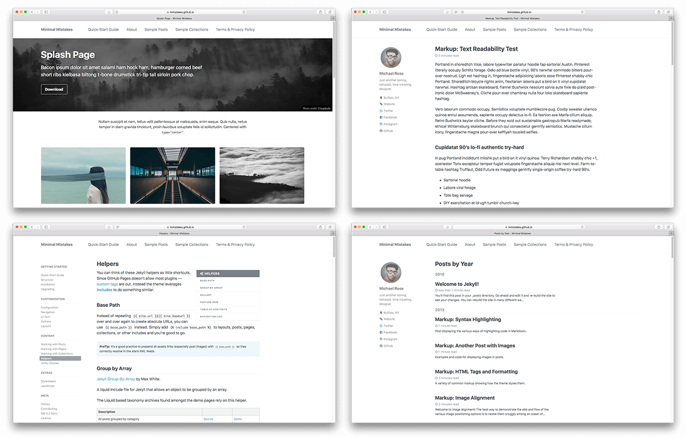

# [Minimal Mistakes Jekyll theme](https://mmistakes.github.io/minimal-mistakes/)

**If you enjoy this theme, please consider [supporting me](https://www.paypal.me/mmistakes) to continue developing and maintaining it.**

**Note:** The theme uses the [jekyll-include-cache](https://github.com/benbalter/jekyll-include-cache) plugin which will need to be installed in your `Gemfile` and added to the `plugins` array of `_config.yml`. Otherwise you'll encounter `Unknown tag 'include_cached'` errors at build.

[![Minimal Mistakes live preview][2]][1]

[

## Notable features

- Bundled as a "theme gem" for easier installation/upgrading.
 Russian, Slovak, Spanish (Español), Swedish, Thai, Turkish (Türkçe), and Vietnamese.

## Skins (color variations)

This theme comes in nine different skins (in addition to the default one).

| `air` | `contrast` | `dark` |
| --- | --- | --- |
|  |  |  |
